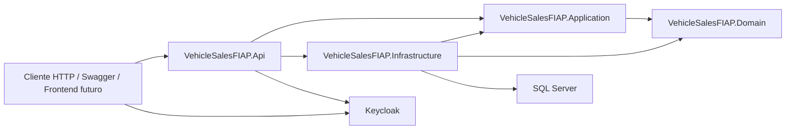
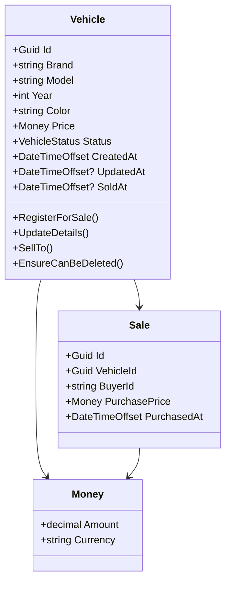
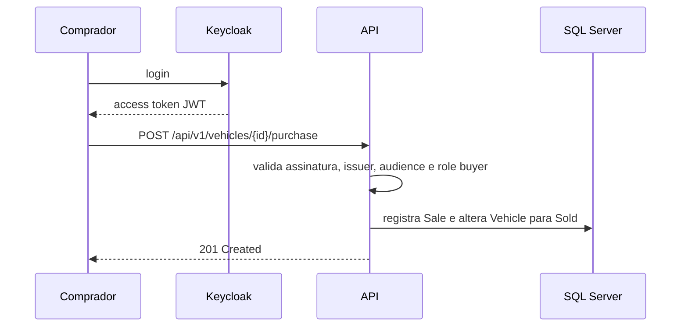
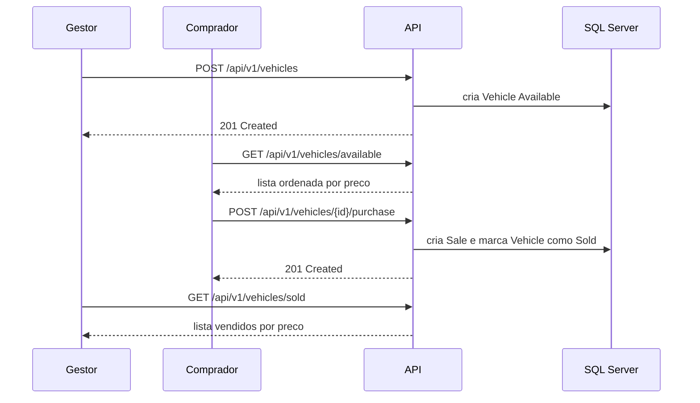

# Architecture

Este documento descreve as decisoes tecnicas da API VehicleSalesFIAP para o Tech Challenge FIAP/SOAT - Fase 3.

## Objetivo Da Solucao

A API atende uma plataforma de revenda de veiculos. O frontend ainda sera desenvolvido por outro time, entao esta entrega concentra o backend, os contratos HTTP, a persistencia transacional e a integracao com um provedor de identidade separado.

Requisitos de negocio cobertos:

- cadastrar veiculo para venda com marca, modelo, ano, cor e preco;
- editar dados de veiculo disponivel;
- listar veiculos disponiveis por preco crescente;
- permitir compra por comprador cadastrado;
- listar veiculos vendidos por preco crescente;
- manter cadastro/autenticacao de clientes separado dos dados de venda.

## Visao Geral



O Keycloak e o responsavel pelo cadastro, login e emissao de tokens dos compradores. A API recebe apenas o JWT e persiste o identificador externo do comprador (`sub`) na venda.

## Clean Architecture

O projeto foi separado em quatro camadas principais.

| Projeto | Responsabilidade | Exemplos |
| --- | --- | --- |
| `VehicleSalesFIAP.Domain` | Regras centrais do dominio, entidades e value objects | `Vehicle`, `Sale`, `Money`, `VehicleStatus` |
| `VehicleSalesFIAP.Application` | Casos de uso, DTOs e contratos de persistencia | `RegisterVehicleForSaleUseCase`, `PurchaseVehicleUseCase`, `IVehicleRepository` |
| `VehicleSalesFIAP.Infrastructure` | Implementacoes tecnicas e acesso a dados | `VehicleSalesDbContext`, repositories, EF Core mappings |
| `VehicleSalesFIAP.Api` | Adaptador HTTP, autenticacao, autorizacao, Swagger e middleware | `VehiclesController`, policies, `ProblemDetails` |

Dependencias permitidas:

```text
Domain
Application -> Domain
Infrastructure -> Application, Domain
Api -> Application, Infrastructure
Tests -> Api, Application, Domain, Infrastructure
```

O dominio nao depende de ASP.NET Core, Entity Framework, SQL Server, Keycloak ou qualquer detalhe externo. Isso preserva as regras de negocio e facilita testes unitarios.

## Modelo De Dominio



Regras centrais:

- `Vehicle` nasce sempre como `Available`.
- marca, modelo e cor sao obrigatorios e normalizados.
- ano deve estar entre 1886 e o proximo ano calendario.
- preco deve ser maior que zero e e arredondado para duas casas.
- veiculo vendido nao pode ser editado, removido ou vendido novamente.
- `Sale` captura o preco no momento da compra para preservar historico.

## Persistencia

O SQL Server guarda apenas dados transacionais:

- `Vehicles`: dados do veiculo, preco, moeda, status e datas.
- `Sales`: venda efetivada, veiculo, comprador externo, preco capturado e data.

O cadastro completo de compradores nao fica no banco da API. Essa separacao atende a exigencia de manter identidade/cadastro apartados da operacao transacional.

O EF Core usa migrations versionadas em:

```text
src/VehicleSalesFIAP.Infrastructure/Persistence/Migrations
```

O Docker Compose possui um servico `migrations`, que aplica as migrations antes da API iniciar.

## Autenticacao E Autorizacao



Roles usadas:

| Role | Uso |
| --- | --- |
| `vehicle-manager` | cadastrar, editar, excluir e listar vendidos |
| `buyer` | comprar veiculo |

Endpoints publicos:

- `GET /api/v1/vehicles/{id}`;
- `GET /api/v1/vehicles/available`;
- `GET /api/v1/health`;
- `GET /health`.

## Fluxo De Compra



## Observabilidade Basica

A API expoe dois endpoints de saude:

- `/api/v1/health`: endpoint simples de contrato da API.
- `/health`: health check tecnico do ASP.NET Core, incluindo verificacao do `VehicleSalesDbContext`.

No Docker Compose, os healthchecks coordenam a subida de SQL Server, Keycloak, migrations e API.

## Alinhamento Com O Conteudo Da Pos

A solucao foi documentada considerando os pontos recorrentes do material consolidado da pos:

- Clean Architecture e SOLID para separar dominio, casos de uso, adaptadores e detalhes externos.
- OAuth 2.0/JWT para desacoplar autenticacao do servico transacional.
- Docker Compose para orquestrar dependencias locais.
- CI/CD com Pull Requests, testes automatizados, analise de formatacao e build de imagem.
- Testes unitarios, integracao e fluxo fim-a-fim para proteger as regras principais.
